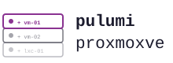

<div align="center">
  <picture>
    <source media="(prefers-color-scheme: dark)" srcset="logo-dark.svg">
    
  </picture>
</div>

## Описание

Инструмент для управления инфраструктурой Proxmox VE через Pulumi (Python).

Конфигурация описывается в одном YAML-файле (`inventory.yaml.j2`), который поддерживает Jinja2-шаблонизацию — включая динамические запросы к Proxmox REST API прямо во время рендеринга. Весь процесс деплоя — интерактивный скрипт внутри Docker-контейнера.

## Что можно задеплоить

- **VM** — виртуальные машины (QEMU/KVM) с полным набором параметров
- **LXC** — контейнеры
- **Storage** — NFS, CIFS, LVM, LVM-thin, ZFS, PBS, Directory
- **Network** — Linux-бриджи и VLAN-интерфейсы на нодах
- **SDN** — зоны, vnets, подсети, fabrics (OpenFabric/OSPF)
- **Firewall** — правила, security groups, aliases, ipsets на уровне кластера/ноды/VM
- **RBAC** — роли, группы, пользователи, токены, ACL, LDAP/OpenID-реалмы
- **ACME** — DNS-плагины, аккаунты, сертификаты
- **HA** — группы, ресурсы, fencing-правила
- **Backup** — задания резервного копирования
- **Replication** — задания репликации
- **Downloads** — ISO и шаблоны контейнеров
- **Node config** — DNS, /etc/hosts, timezone
- **Cluster misc** — параметры кластера, HW mappings, metrics

## Как это работает

`entrypoint.py` оркестрирует весь цикл:

1. Если есть `inventory.yaml.j2` — рендерит его в `inventory.yaml` (Jinja2 + Proxmox REST API)
2. Запускает `pulumi preview` — показывает план изменений
3. Запрашивает подтверждение, затем выполняет `pulumi up`

Все ресурсы управляются одним Pulumi-стеком (`sources/project/`).

## Структура проекта

```text
pulumi-proxmoxve/
  Dockerfile
  entrypoint.py            # оркестратор деплоя (рендеринг → preview → up)
  render_helpers.py        # Jinja2-функции для запросов к Proxmox API
  inventory.yaml.j2        # ваш шаблон конфигурации (gitignore)
  inventory.yaml           # генерируется при запуске (gitignore)
  pulumi-state/            # Pulumi state backend (gitignore)
  sources/
    models.py              # Pydantic-модели всех параметров
    loader.py              # загрузка и валидация inventory.yaml
    vm.py                  # билдер VM
    lxc.py                 # билдер LXC
    cloud_init.py          # генератор cloud-init файла
    ssh_key.py             # генератор SSH-ключа
    storage.py             # билдер storage backends
    network.py             # билдер bridges и VLANs
    firewall.py            # билдер firewall
    rbac.py                # билдер RBAC
    acme.py                # билдер ACME
    ha.py                  # билдер HA
    backup.py              # билдер backup jobs
    replication.py         # билдер replication
    sdn.py                 # билдер SDN
    cluster_misc.py        # билдер cluster options, HW, metrics
    node_config.py         # билдер DNS / hosts / timezone
    pool.py                # билдер pools
    download.py            # билдер file downloads
    project/
      Pulumi.yaml
      __main__.py          # точка входа Pulumi
  docs/
    inventory.yaml.j2      # полный справочник всех параметров с примерами
    jinja_functions.md     # справочник Jinja2-функций для Proxmox API
  agents/
    architecture.md        # описание runtime pipeline
    inventory.md           # справочник модели Inventory
    builders.md            # паттерн добавления нового типа ресурса
    jinja2.md              # справочник render_helpers
```

## Предварительные требования

- Docker
- Proxmox VE с API-токеном

Создать API-токен в Proxmox: `Datacenter → Permissions → API Tokens`.  
Формат: `user@realm!token-id=xxxxxxxx-xxxx-xxxx-xxxx-xxxxxxxxxxxx`

## Быстрый старт

### 1. Создать конфигурацию

Скопировать справочник как основу:

```bash
cp docs/inventory.yaml.j2 inventory.yaml.j2
```

Минимальный пример `inventory.yaml.j2`:

```yaml
provider:
  endpoint: https://<proxmox-ip>:8006
  insecure: true
  api_token: {{ env.PROXMOX_TOKEN }}

vms:
  - name: myvm
    vmid: 101
    node: pve
    networks:
      - bridge: vmbr0
    disks:
      - size: 20
        datastore: local-lvm
```

Полный справочник всех параметров: [`docs/inventory.yaml.j2`](docs/inventory.yaml.j2)

### 2. Собрать образ

```bash
docker build -t pulumi-proxmoxve .
```

### 3. Запустить деплой

```bash
docker run -it \
  -v "$(pwd):/workspace" \
  -e PROXMOX_TOKEN="root@pam!pulumi=xxxxxxxx-xxxx-xxxx-xxxx-xxxxxxxxxxxx" \
  pulumi-proxmoxve
```

Скрипт интерактивный — перед `pulumi up` запрашивает подтверждение.

## Переменные окружения

| Переменная          | Описание                                      |
|---------------------|-----------------------------------------------|
| `PROXMOX_TOKEN`     | API-токен Proxmox (если используется в .j2)   |
| `PROXMOX_ENDPOINT`  | URL Proxmox API (если используется в .j2)     |
| `PROXMOX_NODE`      | Имя ноды (если используется в .j2)            |
| Любые другие        | Доступны в шаблоне через `{{ env.VAR }}`      |

## Jinja2 в inventory.yaml.j2

Шаблон рендерится при каждом старте контейнера. Доступны:

```yaml
# Переменная из окружения
api_token: {{ env.PROXMOX_TOKEN }}

# С fallback
node: {{ env.get('PROXMOX_NODE', 'pve') }}

# Импорт данных из другого файла (путь относительно inventory.yaml.j2)

api_token: {{ secrets.api_token }}

# Запрос к Proxmox API (все функции доступны без импорта)


# Условный блок

sdn:
  ...

```

Справочник всех доступных функций: [`docs/jinja_functions.md`](docs/jinja_functions.md)

## SSH-ключ и cloud-init

Если в `inventory.yaml` есть хотя бы одна VM, при деплое автоматически:

- генерируется ED25519 SSH-ключ (`pulumi_tls`)
- создаётся cloud-init файл с пользователем `ansible` (группа `wheel`, passwordless sudo)
- ключ инжектируется в каждую VM через cloud-init

После деплоя приватный ключ доступен через:

```bash
pulumi stack output ssh_private_key --show-secrets
```

> **Примечание:** cloud-init создаёт пользователя `ansible` с группой `wheel`. Это стандарт для RHEL/CentOS-систем. На Ubuntu/Debian группу нужно поменять на `sudo` в [`sources/cloud_init.py`](sources/cloud_init.py).

## Pulumi state

State сохраняется в `pulumi-state/` внутри примонтированного тома — персистентен между запусками. При первом запуске создаётся автоматически (стек `default`).
